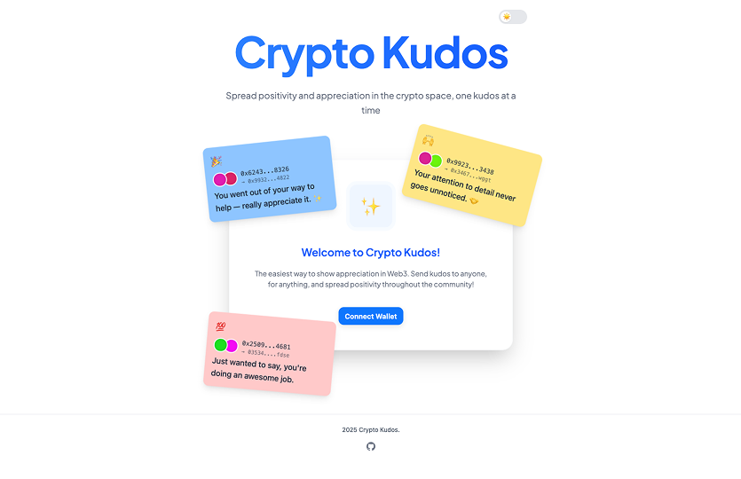
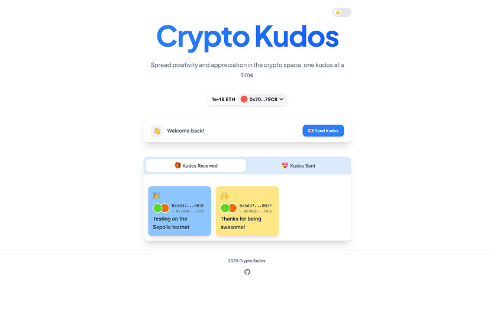

# Crypto Kudos

Crypto Kudos is a decentralised application that allows users to send and receive digital kudos (compliments or acknowledgments) on the blockchain. Built with modern web3 technologies, it provides a seamless way to recognize and appreciate people for their actions, achievements, or simply being awesome in a verifiable and permanent manner.

## Production Deployment

The application is currently deployed to the Sepolia testnet and can be accessed at [https://crypto-kudos.vercel.app/](https://crypto-kudos.vercel.app/). To interact with the application, you'll need to:

1. Connect your wallet to the Sepolia testnet
2. Ensure you have some Sepolia ETH for gas fees
3. Start sending and receiving kudos!




## Project Structure

This monorepo contains the following packages:

- `packages/contracts`: Smart contracts for the Kudos system
- `packages/shared`: Shared types and contract artifacts
- `packages/web`: Next.js frontend application
- `packages/ui`: Shared React components
- `packages/eslint-config`: ESLint configurations
- `packages/typescript-config`: TypeScript configurations

## Prerequisites

- Node.js (v16 or later)
- npm
- MetaMask or another Web3 wallet

## Local Development Setup

### 1. Install Dependencies

```bash
# Install root dependencies
npm install
```

### 2. Smart Contract Development

1. Start a local Hardhat node:

```bash
cd packages/contracts
npm run hardhat:node
```

2. In a separate terminal, deploy the contracts:

```bash
npm run deploy
```

The local node will provide test accounts and private keys for development.

3. In a separate terminal, build the contract types in the shared package:

```bash
cd packages/shared
npm run build
```

### 3. Frontend Development

1. Start the development server:

```bash
cd packages/web
npm run dev
```

2. Open [http://localhost:3000](http://localhost:3000) in your browser

3. Connect your MetaMask wallet to the local network:
   - Network Name: Hardhat
   - RPC URL: <http://127.0.0.1:8545>
   - Chain ID: 31337
   - Currency Symbol: ETH

## Available Scripts

### Root Level

- `npm run install:all` - Install dependencies for all packages
- `npm run build` - Build all packages
- `npm run dev` - Start development servers
- `npm run test` - Run tests across all packages

### Contracts Package

- `npm run compile` - Compile smart contracts
- `npm run deploy` - Deploy contracts to local network
- `npm run hardhat:node` - Start local Hardhat node
- `npm run test` - Run contract tests

### Web Package

- `npm run dev` - Start development server
- `npm run build` - Build production bundle
- `npm run start` - Start production server

### UI Package

- `npm run build-css` - Build the Tailwind CSS stylesheet from the input CSS file
- `npm run build-css:watch` - Build and watch for changes to the Tailwind CSS stylesheet

## Project Architecture

### Smart Contracts

The Kudos smart contract (`packages/contracts/contracts/Kudos.sol`) handles:

- Creating and managing kudos tokens
- Tracking ownership and transfers
- Managing metadata and attributes

### Frontend

The web application (`packages/web`) provides:

- User interface for sending and receiving kudos
- Wallet integration
- Transaction management
- Token display and interaction

### Shared Package

The shared package (`packages/shared`) contains:

- Contract ABIs and addresses
- Shared types and utilities
- Common interfaces
